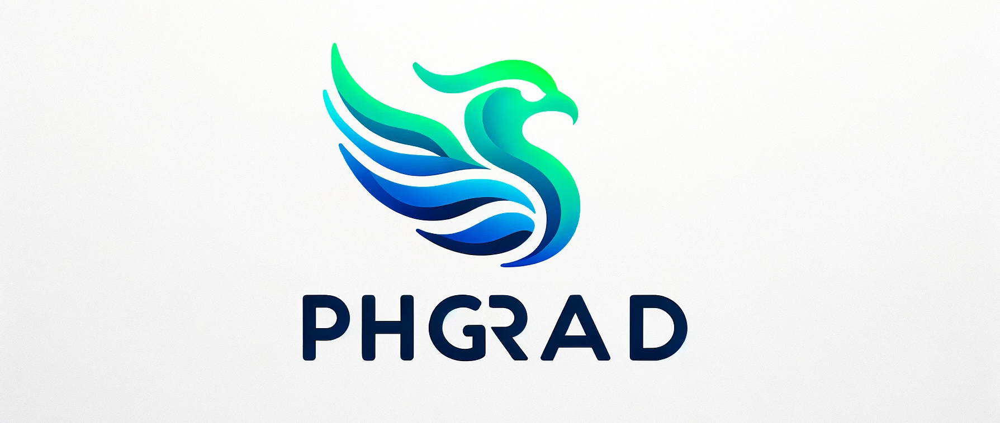

# phgrad 

### Cause there are not enough unusable autograd libraries in python



A tiny [autograd](https://en.wikipedia.org/wiki/Automatic_differentiation) library for learning purposes, inspired by [micrograd](https://github.com/karpathy/micrograd/tree/master)
and [tinygrad](https://github.com/tinygrad/tinygrad).

Everything at this point is experimental and not optimized for performance. So be aware that if you
touch this library, you will probably break something.
The goal is to optimize the library for performance and add more features. I will mostly adjust this library to 
be usable in NLP tasks.

I will try to keep the API as close as possible to [PyTorch](https://pytorch.org/). A goal is to
provide CUDA support, while keeping the dependency list as small as possible. (Currently only numpy, and now cupy).

The [example](./examples) folder will contain some examples of how to use the library.


### Example

```python

from phgrad.engine import Tensor
from phgrad.nn import Linear, Module

# We now have cuda support!
device = "cuda"

class Classifier(Module):
    def __init__(self):
        self.l1 = Linear(784, 64, bias=True, device=device)
        self.l2 = Linear(64, 2, bias=True, device=device)

    def forward(self, x: Tensor):
        x = self.l2(self.l1(x).relu())
        # LogSoftmax is also a custom cuda kernel
        # 🚀 Wow, blazingly fast!
        return x.log_softmax(dim=-1)

model = Classifier()
x = Tensor(np.random.randn(32, 784), device=device)
y = model(x)
y.backward()

```


### Resources
1. https://github.com/torch/nn/blob/master/doc/transfer.md
2. https://github.com/karpathy/micrograd/tree/master
3. https://github.com/geohot/ai-notebooks/blob/master/mnist_from_scratch.ipynb
4. https://github.com/ICEORY/softmax_loss_gradient
5. https://notesbylex.com/negative-log-likelihood#:~:text=Negative%20log%2Dlikelihood%20is%20a,all%20items%20in%20the%20batch.
6. https://github.com/huggingface/candle/tree/main

